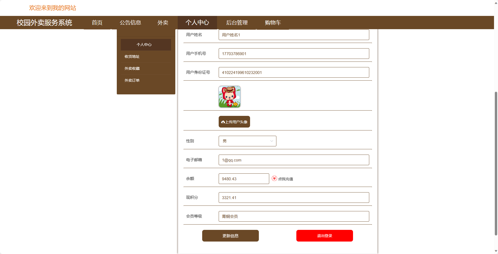

基于SpringBoot的校园外卖服务系统（程序+论文）
=
- 完整代码获取地址：从戎源码网 ([https://armycodes.com/](https://armycodes.com/))
- 作者微信：19941326836  QQ：952045282 
- 承接计算机毕业设计、Java毕业设计、Python毕业设计、深度学习、机器学习
- 选题+开题报告+任务书+程序定制+安装调试+论文+答辩ppt 一条龙服务
- 所有选题地址https://github.com/nature924/allProject

一、项目介绍
---
基于Spring Boot框架实现的校园外卖服务系统，系统包含两种角色：管理员、用户,系统分为前台和后台两大模块，主要功能如下。
### 前台：

首页：展示校园外卖服务系统的相关内容。
公告信息：展示校园内外卖服务的公告信息。
外卖：浏览并订购外卖，包括浏览菜单、添加到购物车等操作。
个人中心：管理个人信息，包括订单记录、个人设置等。
购物车：管理用户选购的商品，包括添加、删除、结算等操作。

### 后台（管理员）：

个人中心：管理个人信息。
基础数据管理：管理系统中的基础数据。
公告信息管理：管理外卖服务的公告信息。
外卖管理：管理外卖信息，包括菜品管理、商家管理等操作。
用户管理：管理用户账号信息。
轮播图信息：管理系统的轮播图信息，包括添加、编辑、删除等操作。

### 用户后台：

个人中心：用户可以查看和管理个人信息，包括订单记录、个人设置等。
公告信息管理：用户可以查看系统发布的公告信息。
外卖管理：用户可以查看外卖菜单，管理收货地址。

二、项目技术
---
- 编程语言：Java
- 数据库：MySQL
- 项目管理工具：Maven
- 前端技术：VUE、HTML、Jquery、Bootstrap
- 后端技术：Spring、SpringMVC、MyBatis

三、运行环境
---
- 操作系统：Windows、macOS都可以
- JDK版本：JDK1.8以上都可以
- 开发工具：IDEA、Ecplise、Myecplise都可以
- 数据库: MySQL5.7以上都可以
- Tomcat：任意版本都可以
- Maven：任意版本都可以

四、运行截图
---
### 论文截图：

### 程序截图：

